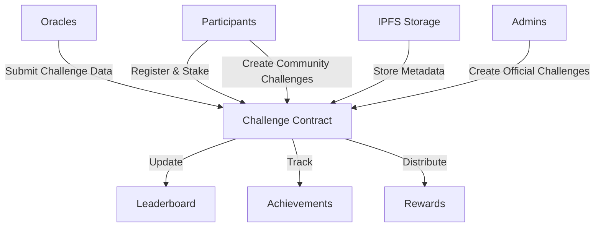

# IPFS Schedule: Decentralized Challenge Platform

A blockchain-based platform for creating, tracking, and rewarding diverse community challenges with decentralized data management.

## Overview

IPFS Schedule enables users worldwide to participate in various challenges using blockchain technology and decentralized storage. The platform features:

- Creation and participation in diverse challenges
- IPFS-based data storage and verification
- Automated reward distribution based on achievement
- Real-time leaderboards
- Both official and community-created challenges
- Stake-to-participate mechanism

## Architecture

The IPFS Schedule system is built around a core smart contract that handles:



### Core Components:
- Challenge Management
- Participant Registration
- Step Data Verification
- Achievement Tracking
- Reward Distribution
- Leaderboard System

## Contract Documentation

### IPFS Challenge Contract (`ipfs-challenge.clar`)

The main contract managing the entire IPFS Schedule ecosystem.

#### Key Features:
- Role-based access control (Admin, Oracle)
- Challenge creation and management
- Participant registration and tracking
- Challenge data submission and verification
- Achievement tracking
- Automated reward distribution
- Real-time leaderboard updates
- Decentralized metadata storage via IPFS

#### Access Control
- Contract Owner: Full administrative control
- Admins: Can create official challenges and manage platform
- Oracles: Authorized to submit verified step data
- Users: Can participate in challenges and create community challenges

## Getting Started

### Prerequisites
- Clarinet
- Stacks wallet
- STX tokens for participation

### Basic Usage

1. **Creating a Challenge**
```clarity
(contract-call? .ipfs-challenge create-challenge
    "30-Day Community Challenge"
    "Complete a unique community-driven objective"
    false  ;; community challenge
    u1234567890  ;; start time
    u1237246290  ;; end time
    u100  ;; achievement goal
    u50  ;; difficulty multiplier
    u100000000  ;; entry fee in microSTX
    u100  ;; max participants
    u0)  ;; initial reward pool
```

2. **Registering for a Challenge**
```clarity
(contract-call? .ipfs-challenge register-for-challenge u1)
```

3. **Submitting Step Data (Oracle)**
```clarity
(contract-call? .ipfs-challenge submit-step-data 
    u1  ;; challenge-id
    tx-sender  ;; participant
    u5000  ;; steps
    u4000)  ;; distance
```

4. **Claiming Rewards**
```clarity
(contract-call? .ipfs-challenge claim-rewards u1)
```

## Function Reference

### Administrative Functions
- `set-contract-owner`: Update contract owner
- `grant-role`: Assign roles to addresses
- `revoke-role`: Remove roles from addresses

### Challenge Management
- `create-challenge`: Create new walking challenge
- `end-challenge`: Conclude an active challenge
- `add-to-reward-pool`: Add funds to challenge rewards

### Participant Functions
- `register-for-challenge`: Join a challenge
- `claim-rewards`: Collect earned rewards

### Oracle Functions
- `submit-step-data`: Submit verified step counts

### Read-Only Functions
- `get-challenge`: Retrieve challenge details
- `get-participant-data`: Get participant statistics
- `get-leaderboard`: View challenge rankings
- `get-achievements`: Check participant achievements
- `get-estimated-reward`: Calculate potential rewards

## Development

### Testing
```bash
# Run contract tests
clarinet test

# Check contract deployment
clarinet console
```

### Local Development
1. Clone the repository
2. Install Clarinet
3. Deploy contracts locally:
```bash
clarinet deploy --local
```

## Security Considerations

### Known Limitations
- Relies on trusted oracles for step data
- Leaderboard limited to top 50 participants
- Challenge duration constraints (1-30 days)

### Best Practices
- Verify challenge parameters before participation
- Wait for transaction confirmation before UI updates
- Monitor oracle submissions for anomalies
- Review reward calculations before claiming

### Risk Mitigation
- Step data must increase monotonically
- Rewards locked until challenge completion
- Role-based access control for critical functions
- Challenge parameters validated at creation